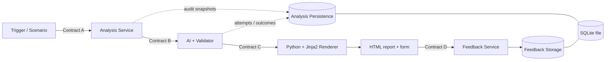

# Database Reliability Advisor

An intentionally lightweight, **mock-first foundation** for an AI-assisted database reliability advisor. Default execution uses `MockAdapter` and `MockAIProvider`; it makes no Gemini call and requires no AI credentials. Fixture values are illustrative, not production telemetry.

## Architecture



Analysis persistence and feedback are separate workstreams/repositories even though SQLite is shared. SQLite is not used to find current evidence for AI. AI returns structured data, normal Python code assembles Contract C, and Jinja2 renders escaped HTML.

## Quick start

Requirements: Docker Compose, `curl`, and Python 3.

```bash
cp .env.example .env
make up
make demo-query
make demo-connection
make smoke
make test
```

Open the Analysis UI at `http://localhost:8000/` to submit a manual analysis with only a target and time window. Each demo also prints its report URL. Open Grafana at `http://localhost:3001` (`admin` / `admin` locally). The **MongoDB Diagnostic Logs** panel is configured for the runtime-verified Loki query `{service="mongodb"}` over the last six hours. Alloy reads `/var/log/mongodb/mongod.log`; Loki exposes `service="mongodb"` and `source="diagnostic-log"` labels.

Manual API trigger:

```bash
curl -X POST http://localhost:8000/api/v1/analyses \
  -H 'Content-Type: application/json' \
  -d '{"target":"orders-api","startTime":"2026-09-20T11:00:00Z","endTime":"2026-09-20T11:10:00Z"}'
```

The API returns the analysis ID; open `/analyses/{analysisId}/report` for the HTML report. Contract A intentionally contains only `target`, `startTime`, and `endTime`. In development, the UI also exposes query-regression and connection-pressure fixture buttons; fixture selection stays outside Contract A and enters the same pipeline.

The default `AI_PROVIDER=mock` is deterministic and suitable for local tests. To exercise Gemini, set `AI_PROVIDER=gemini`, provide `GEMINI_API_KEY`, and optionally change `GEMINI_MODEL` (default `gemini-2.5-flash`). Gemini supplies interpretation only: trusted values, charts, provenance, and verification queries come from Contract B/application code. Mock verification entries are explicitly labelled illustrative and were not executed.

Reports distinguish status from hypothesis confidence, show supporting versus contradicting evidence, recommend a next investigation with its purpose, and keep limitations prominent. Feedback is submitted from the report form to Contract D and stored separately from analysis evidence.

Other endpoints: Analysis Service/OpenAPI `http://localhost:8000/docs`, Orders API `http://localhost:8001/docs`, Prometheus `http://localhost:9090`, Alertmanager `http://localhost:9093`, Loki readiness `http://localhost:3100/ready`.

The demos call development-only selectors that build ordinary Contract A requests and enter the same pipeline. Scenario selection is never part of Contract A. Run `make setup` for Python-only development, `make lint` for Ruff, and `docker compose config --quiet` to validate Compose. `make reset` removes named volumes, including local SQLite and Mongo data.

## Future work boundaries

- Real workloads/triggers belong to **DBADV-01**.
- Prometheus/Loki/Mongo analysis belongs to **DBADV-02**; connectivity/visualization does not mean a real analysis adapter exists.
- Advanced grounding, repair/fallback policy and production Gemini behavior belong to **DBADV-03**.
- **DBADV-04** owns server-rendered HTML; **DBADV-05** owns analysis audit; **DBADV-06** owns feedback workflow/storage.

See [docs/WORKSTREAMS.md](docs/WORKSTREAMS.md), [docs/ARCHITECTURE.md](docs/ARCHITECTURE.md), and [docs/CONTRACTS.md](docs/CONTRACTS.md).

## Optional Gemini provider

The Google GenAI SDK is available for deliberate network-backed experiments. Configure `AI_PROVIDER=gemini`, `GEMINI_API_KEY`, and `GEMINI_MODEL`; mock mode remains the default. This foundation does not claim advanced semantic grounding.

## Repository map

```text
contracts/                         Project-level JSON Schemas and examples
services/analysis_service/app/     Pipeline, adapters, AI, storage, Jinja reports
services/orders_api/app/           Instrumented MongoDB demo API
services/scenario_runner/          Mock scenario CLI
infra/                             MongoDB, Prometheus, Alertmanager, Loki, Alloy, Grafana
migrations/                        Alembic lifecycle
tests/                             Contract, unit, integration and smoke tests
scripts/                           Seed, demo and smoke utilities
docs/                              Architecture, contracts, development and ownership
```
