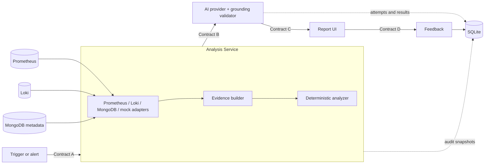

# Database Reliability Advisor

An intentionally lightweight, mock-first foundation for an AI-assisted database reliability advisor. It correlates bounded telemetry evidence, deterministic rules, and a grounded AI interpretation into a validated report. The two included scenarios exercise one shared architecture and the same frozen contracts.

> **Default execution uses mocks.** It makes no Gemini call and requires no AI credentials. Every fixture value is explicitly mock / illustrative, never production telemetry.

## Architecture



SQLite is audit/history storage, not a live evidence source. Prometheus remains the metrics store and Loki remains the logs store. The AI provider never writes to MongoDB.

## Quick start

Requirements: Docker with Compose, `curl`, and Python 3 for pretty-printing demo output.

```bash
cp .env.example .env
make up
make demo-query
make demo-connection
```

Open the UI at [http://localhost:8080](http://localhost:8080). Both demo commands call development-only fixture selectors, which then enter the exact same `AnalysisPipeline`. The fixture choice is not part of Contract A.

Useful service URLs:

| Service | URL | Local credentials |
|---|---|---|
| Report UI | http://localhost:8080 | none |
| Analysis Service / OpenAPI | http://localhost:8000/docs | none |
| Orders API / OpenAPI | http://localhost:8001/docs | none |
| Prometheus | http://localhost:9090 | none |
| Alertmanager | http://localhost:9093 | none |
| Loki | http://localhost:3100/ready | none |
| Grafana | http://localhost:3001 | `admin` / `admin` for local use |
| MongoDB | `localhost:27017` | local-only users in `infra/mongo/init/` |

Run `make smoke` after the stack becomes healthy. Seeding 200,000 deterministic orders is optional (`make seed`) and is not needed by the mock flow.

## Development and tests

```bash
make setup
make lint
make test
npm --prefix web run build
docker compose config
```

`make help` lists all supported commands. `make reset` removes this project's Docker containers and named volumes, including the local SQLite audit file and seeded MongoDB data.

## Optional Gemini provider

The official `google-genai` Python SDK is included. Set these values only when deliberately opting into network-backed analysis:

```dotenv
AI_PROVIDER=gemini
GEMINI_API_KEY=your_key_here
GEMINI_MODEL=gemini-2.5-flash
```

Missing Gemini configuration fails at startup with a clear error. CI and the default `.env.example` use `AI_PROVIDER=mock`.

## Repository map

```text
contracts/                         Authoritative JSON Schemas and examples
services/analysis_service/app/     Orchestration, adapters, rules, AI, validation, storage
services/orders_api/app/           Minimal MongoDB-backed instrumented demo API
services/scenario_runner/           Mock scenario CLI
web/                               Minimal React/Vite report scaffold
infra/                             MongoDB, Prometheus, Alertmanager, Loki, Alloy, Grafana
migrations/                        Initial Alembic migration
tests/                             Contract, unit, integration, and smoke entry points
scripts/                           Seed, demo, and smoke utilities
docs/                              Architecture, contracts, development, and workstreams
```

See [docs/WORKSTREAMS.md](docs/WORKSTREAMS.md) before replacing a mock. Project contracts are frozen; changing them requires explicit architecture review.

## Pinned container versions

The foundation pins MongoDB 8.0.32, Percona MongoDB Exporter 0.53.0, Prometheus 3.14.0, Alertmanager 0.34.1, Loki 3.7.8, Grafana Alloy 1.19.2, Grafana 13.2.2, Python 3.12.12, Node 22.23.2, and Nginx 1.30.5. Upgrade versions deliberately and run the full smoke test afterward.
