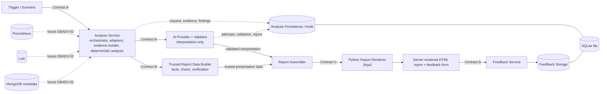

# Architecture

The frozen project flow keeps audit persistence parallel to live analysis. Analysis Persistence and Feedback are separate responsibilities even though both currently use the same SQLite database.

Contract A is only `target`, `startTime`, and `endTime`. Trigger metadata and scenario selection do not expand the contract. Development-only fixture selectors use the same pipeline.

The Analysis Service sends Contract B directly to AI and to `TrustedReportDataBuilder`; it does not read current evidence back from SQLite. Persistence is a side path for audit/replay. AI returns only a strict interpretation (hypotheses, confidence, citations, checks, and limitations). The builder copies/derives facts, numeric chart/table values, and PromQL/LogQL from Contract B evidence and deterministic findings. `ReportAssembler` composes both into Contract C. AI never generates HTML. Jinja renders Contract C with autoescaping enabled.

DBADV-02 owns Contract B production, source adapters, evidence, and deterministic findings. The builder and assembler are DBADV-04 composition code; the interpretation model and validator are DBADV-03 boundary code.

The default runtime uses `MockAdapter` and `MockAIProvider`. Prometheus/Loki/Mongo analysis, realistic workloads and advanced grounding remain future ticket work as defined in `WORKSTREAMS.md`. Grafana log visibility is infrastructure and is not the future Loki analysis adapter.
